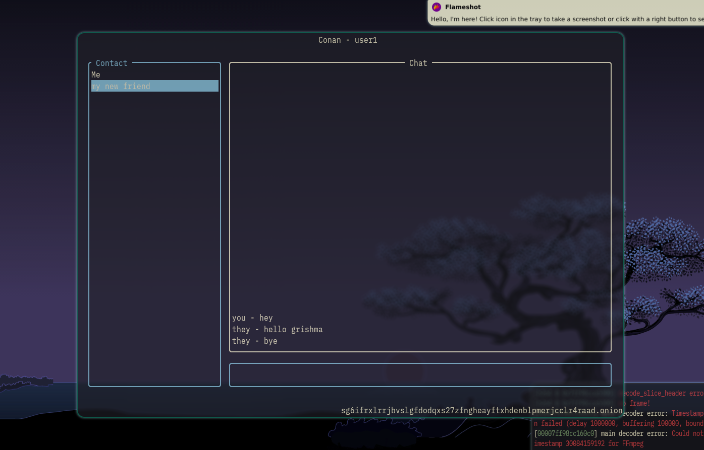

# Conan



## What is it?

Conan in short is a Tor-based fully Decentralized Terminal Chat app in Rust taking its name from [Conan - The Bacterium](https://en.wikipedia.org/wiki/Deinococcus_radiodurans)

## Why should you use Conan?

Conan was built for a single purpose, provide **COMPLETE** privacy and anonymity over communication.

Here's how:

- It's talks through the Tor Network. So you get near zero traceability.
- It's integrated with a custom Application level Cryptography that is based on ECDHE-Ed25519 Authenticated Key Exchange with `PFS` or Perfect Forward Secrecy, meaning even if your Private key gets out, there is no way to decrypt old messages. So even if the channel is **SOMEHOW** being listened to via Man in the Middle, there is not a chance of decryption.
- To prevent **MitM** Attacks, both the parties are required to verify their claims of owning their address to each other before transfering any message (assuming they exchanged their address over other media and already trust each other).

## How do I install Conan?

- To install Conan, clone this repository to your local space.

```sh
git clone https://github.com/grishmadev/conan.git
```

- Once cloned, execute the `Makefile` with this command

```sh
make install
```

## How to run?

Straight forward, type

```sh
conan # No parameters means its using the default user
```

If you wish to use multiple accounts in the same machine, type

```sh
conan -c <path to your config.toml>
```

## Configuration

Since this project is new, there's not much flexibility except file locations.

```toml
database-path = "path/to/yout/database"
socket-path = "path/to/socket"
cache-path = "path/to/cache"
key-path = "path/to/crypto/keys"
```

Some examples are provided to you in .

## Flags

- Config file

```sh
conan -c <path to config file>
```

- Socket Path

```sh
conan -s <socket path>
```

- Key Store Path

```sh
conan -k <key store path>
```

- Cache Store Path

```sh
conan -C <cache store path>
```

- Database Path

```sh
conan -d <database path>
```

Together, these can be combined:

```sh
conan -s <socket path> \
-k <key store path> \
-C <cache store path> \
-d <database path>

```

## Keybindings

| Key                   | Action                                                                      |
| --------------------- | --------------------------------------------------------------------------- |
| `Tab`                 | Switches between Contact and Chats                                          |
| `j`, `k`,`Up`, `Down` | Movement across Contacts                                                    |
| `a`                   | Add new Peer                                                                |
| `r`                   | Rename Peer                                                                 |
| `d`                   | Delete Contact                                                              |
| `i`                   | Enter Insert Mode (beta)                                                    |
| `Enter`               | Connects Contact, Send Messages, Affirm Input and Confirmation Screens etc. |

## License

This Project uses an MIT License.
